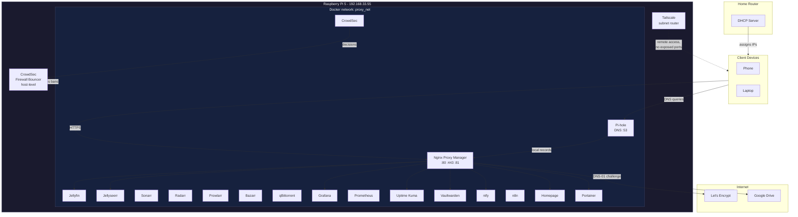
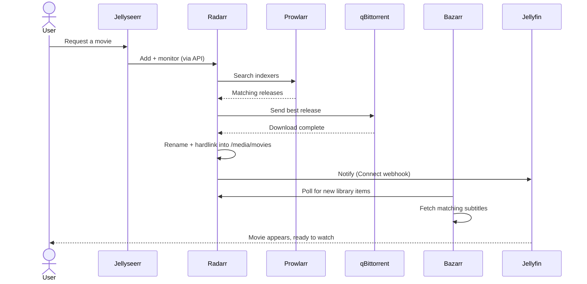
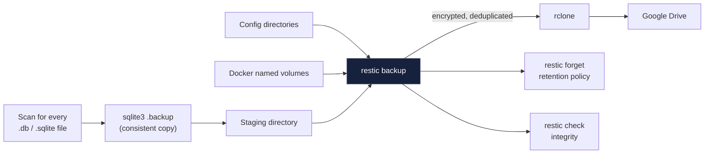

# Architecture

## Network topology

Everything runs on a single Raspberry Pi 5 at a static LAN IP, with Pi-hole handling DNS and Nginx Proxy Manager (NPM) terminating HTTPS for internal hostnames. All containers share a custom Docker bridge network (`proxy_net`) rather than the default `bridge` network, since only custom networks get Docker's embedded container-name DNS resolution.

## Media automation pipeline

A request flows from a friend/family member all the way to a playable file in Jellyfin without any manual intervention.

## Backup flow

SQLite databases are snapshotted consistently *before* the main backup runs, so nothing is ever backed up mid-write.

## Design decisions worth calling out

**Why a custom bridge network instead of Docker's default `bridge`?**
Docker's default `bridge` network has no embedded DNS - containers can only reach each other by IP. A custom network (`proxy_net`) gets automatic container-name resolution, so NPM can proxy to `grafana:3000` instead of a hardcoded IP that changes on every recreate.

**Why DNS-01 challenge instead of exposing port 80/443 publicly?**
The entire stack is LAN-only by design. Using a DuckDNS subdomain purely for the DNS-01 Let's Encrypt challenge gets a *real*, browser-trusted certificate (required for Vaultwarden's clipboard API and WebAuthn, and for ntfy's push notifications - both need a secure browser context) without ever exposing a port to the internet. Pi-hole then overrides that public domain to resolve locally.

**Why Tailscale as a host-level subnet router instead of per-device or in-container?**
Running it directly on the Pi and advertising the whole `/24` subnet means every device on the tailnet gets access to the entire LAN through one connection - no need to install Tailscale on every service individually, and no ports ever opened on the router.

**Why SQLite `.backup` instead of stopping containers for backups?**
Nearly every service in this stack (Sonarr, Radarr, Prowlarr, Jellyseerr, Jellyfin, NPM, CrowdSec, Grafana, Pi-hole, Vaultwarden, n8n, Uptime Kuma) uses embedded SQLite. Stopping all of them nightly would mean real downtime. SQLite's Online Backup API produces a fully consistent copy of a live database with zero downtime, so the backup script scans for every `.db`/`.sqlite` file generically rather than hardcoding a per-service stop list.
