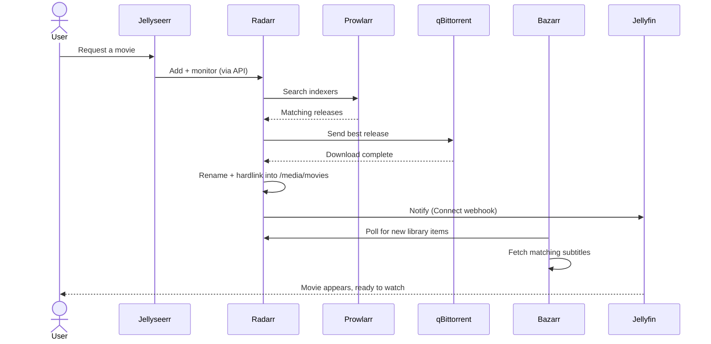

# Automation

Two distinct kinds of automation run in this environment: **operational automation** (backups, notifications, container lifecycle) that keeps the infrastructure itself running with minimal manual intervention, and a **workload automation pipeline** (media request fulfillment) that exists partly as a genuinely useful service and partly as a reliable generator of real orchestration, API-integration, and race-condition problems to solve.

## Operational automation

- **Scheduled, SQLite-consistent backups** - see [Backup & Disaster Recovery](backup.md) for the full design
- **ntfy notifications** wired from Uptime Kuma, the media pipeline, and CrowdSec - see [Monitoring](monitoring.md)
- **n8n** - general-purpose workflow automation, used as connective tissue between services that don't have a native integration path with each other

## Container lifecycle automation, and where it went wrong

Watchtower automates container image updates on a schedule. In this environment, it was paired with an external cron job controlling when updates run - and those two lifecycle-management mechanisms (Docker's own `restart: unless-stopped` policy, and an independent cron schedule) ended up fighting each other, producing a genuine crash loop that took real diagnostic work to trace back to its cause. Full incident writeup in [Lessons Learned](lessons-learned.md#the-watchtower-crash-loop).

The lesson generalizes beyond this one container: any time two independent systems both believe they own a resource's lifecycle, they will eventually conflict. The fix wasn't a workaround - it was picking exactly one system to own it.

## Workload automation: the media request pipeline

Requests flow from a front-end interface through indexer search, download, and library import without manual intervention:

This pipeline is what actually produced two of the more interesting troubleshooting problems in this project - a request that silently never got imported because it bypassed the orchestration layer entirely, and an indexer that returned zero results due to a category-mapping mismatch invisible anywhere except by reading through the actual search logic. Both are in [Lessons Learned](lessons-learned.md).

**The infrastructure detail that makes it work**: every service in the pipeline mounts the *same* parent filesystem path for downloads and the media library, which allows the orchestrator to hardlink a finished download directly into the library instead of copying it - instant, no duplicated disk usage, and the original file keeps seeding while simultaneously appearing in the library. Hardlinks only work within a single filesystem, which is why this shared-path design is a deliberate constraint, not a coincidence.

The point of documenting this pipeline in this much detail isn't the media use case - it's that "orchestrate multiple services via their APIs, handle the failure modes when one step is bypassed or misconfigured, and design the filesystem layout around how the tools actually behave" is a fully general infrastructure automation problem that happens to have a media pipeline as its example here.
